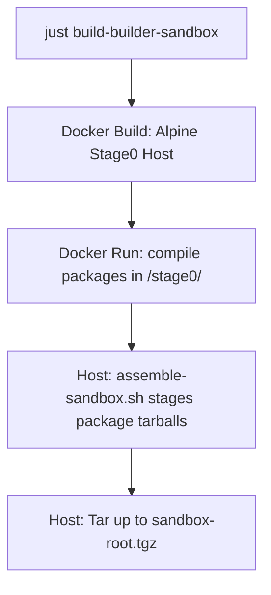

# Freeside Bootstrapping Process

This document describes the design, architecture, and operation of the Freeside bootstrapping system used to generate the builder sandbox rootfs.

---

## 1. Overview & Objective

The main goal of the bootstrapping system is to generate the **Builder Sandbox** (`build/sandbox-root.tgz`). 

This sandbox is a minimal, self-contained root filesystem that contains all the packages from the **base** and **builder** groups. The Straylight package manager uses this sandbox to run clean, isolated, and reproducible builds of Freeside packages inside ephemeral `systemd-nspawn` containers.

---

## 2. Bootstrapping Architecture

Bootstrapping is divided into three distinct phases to ensure isolation and reproducibility:



### Phase A: Stage0 Host Build Environment (Docker)
We use Alpine Linux 3.20 as our Stage0 build host environment because it is musl-based, matching Freeside's target triple (`x86_64-freeside-linux-musl`).
*   **Definition**: [bootstrap/Dockerfile](file:///home/dq/Code/freeside/bootstrap/Dockerfile)
*   **Role**: Installs all native toolchains (Clang, LLVM, LLD, Rust, Cargo, CMake, Make, Ninja, Meson), build scripts, shell utilities, and target development headers (musl-dev, zlib-dev, openssl-dev, readline-dev, etc.) required to build Freeside packages from source.
*   **Mounts**: The monorepo's `packages/` directory is mounted read-only at `/freeside/packages` and the `build/` directory is mounted at `/freeside/build`.

### Phase B: Inside the Container Package Compilation
The compilation script compiles all base and builder packages inside the Stage0 Docker host.
*   **Definition**: [bootstrap/build-packages.sh](file:///home/dq/Code/freeside/bootstrap/build-packages.sh)
*   **Process**:
    1.  Parses TOML manifests from `/freeside/packages/*/package.manifest` using Python's `tomllib`.
    2.  Filters packages to only those belonging to the `base` and `builder` groups.
    3.  Performs a topological sort on dependencies to establish the correct build order.
    4.  Extracts and compiles each package in `/tmp/build/` using `just build` followed by `just package`.
    5.  Bundles the staging directories to `.tar.gz` packages saved to `/freeside/build/packages/`.
    6.  Installs the newly compiled package into the container's host prefix `/usr` so later packages in the topological order can build against them.

### Phase C: Host Rootfs Assembly
The assembly script runs on the development machine (outside of Docker) to create the actual sandbox filesystem.
*   **Definition**: [bootstrap/assemble-sandbox.sh](file:///home/dq/Code/freeside/bootstrap/assemble-sandbox.sh)
*   **Process**:
    1.  Inspects the built tarballs under `build/packages/` and extracts those belonging to the `base` and `builder` groups into a staging directory.
    2.  Sets up the **UsrMerge** layout:
        *   `/bin` $\rightarrow$ `usr/bin`
        *   `/sbin` $\rightarrow$ `usr/bin`
        *   `/lib` $\rightarrow$ `usr/lib`
        *   `/lib64` $\rightarrow$ `usr/lib`
    3.  Creates system directories: `/tmp`, `/proc`, `/sys`, `/dev`, `/run`, `/var`, `/etc`, and `/root`.
    4.  Configures essential conveniences like `sh -> bash` and `python -> python3` symlinks.
    5.  Packs the rootfs into `build/sandbox-root.tgz` preserving file permissions and ownership (requires `sudo`).

---

## 3. Package Group Organization

To keep the builder sandbox lightweight and prevent init system or package manager pollution, the package groups are organized as follows:

*   **`base`**: The absolute minimum runtime environment (e.g. `base-files`, `musl`, `bash`, `uutils-coreutils`, `ca-certificates`, `openssl`, `curl`, `git`, `gzip`, `zlib`, `ncurses`, `readline`, `python3`, `libffi`).
*   **`builder`**: Compilers, build automation, and build-time utilities (e.g. `llvm`, `rust`, `make`, `ninja`, `cmake`, `gettext`, `unzip`).
*   **`system`**: User-space system management tools, service daemons, and components required for a running Freeside OS but **not** needed during compilation inside the sandbox (e.g. `systemd`, `straylight`, `libarchive`, `libcap`, `libexpat`, `util-linux`, `vim`).

---

## 4. Straylight Sandbox Integration

Straylight integrates with the sandbox transparently using the following logic in [straylight/src/build.rs](file:///home/dq/Code/freeside/straylight/src/build.rs):

1.  **Builder Root Resolution**: Looks for the `STRAYLIGHT_BUILDER_ROOT` environment variable, falling back to the monorepo's `build/` folder.
2.  **Sandbox Detection & Extraction**:
    *   Straylight checks for the sandbox directory under `$STRAYLIGHT_BUILDER_ROOT/sandbox`.
    *   If it does not exist, it locates `$STRAYLIGHT_BUILDER_ROOT/sandbox-root.tgz` and automatically extracts it to `$STRAYLIGHT_BUILDER_ROOT/sandbox` using host-side `tar`.
3.  **Container Chroot execution**: Runs `systemd-nspawn -D $STRAYLIGHT_BUILDER_ROOT/sandbox` to execute compile recipes within the clean sandbox environment.
4.  **Artifact Output**: Finished package tarballs are saved back to `$STRAYLIGHT_BUILDER_ROOT/packages/`.

---

## 5. Usage & Recipes

To bootstrap the system, run from the repository root:

```bash
# Enter bootstrap directory and run the build command
cd bootstrap
just build-builder-sandbox
```

To clean up all bootstrap staging directories, compiled packages, logs, and docker images:
```bash
cd bootstrap
just clean
```
