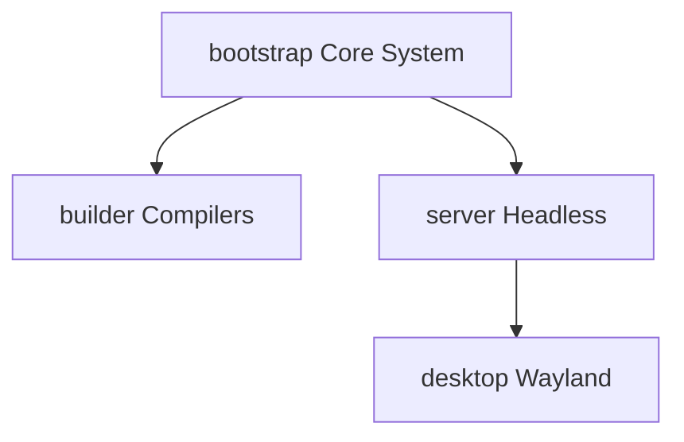

# Freeside Package Registry

**Version:** 1.3.0-Stable  
**Architecture Target:** x86_64-freeside-linux-musl  
**Distribution Channel:** stable

## 1. Profile Inheritance & Dependency Flow

Freeside minimizes composition bloat by strictly passing packages down an inheritance chain. When a node targets a specific profile, it implicitly acquires all packages from the parent layers.



## 2. Profile Manifests

### A. The bootstrap Profile

The minimal, zero-dependency baseline required to mount filesystems, bring up local network slices, execute the early init phase, and invoke straylight.

| Package Name | Link Target / Format | Operational Role |
| :--- | :--- | :--- |
| **musl** | `/lib/ld-musl-x86_64.so.1` | Standard C library and dynamic linker |
| **uutils-coreutils** | Dynamic (musl) | Rust-native system utilities (`ls`, `cp`, `mkdir`, etc.) |
| **systemd** | Dynamic (musl) | Init system, `udev`, `logind`, `networkd`, `resolved` |
| **straylight** | Dynamic (musl) | Custom package manager and state orchestrator |
| **linux-hardened** | Native Kernel EFI | Hardened, long-term support kernel |
| **btrfs-progs** | Dynamic (musl) | Filesystem maintenance, snapshot, and volume scaling |
| **cryptsetup** | Dynamic (musl) | LUKS2 volume encryption and disk-unlocking layers |
| **libarchive** | Dynamic (musl) | Multi-format archive/streaming engine for container extractions |
| **sbctl** | Dynamic (musl) | Secure Boot key manager used to cryptographically enroll UKI targets |
| **dbus-broker** | Dynamic (musl) | High-performance D-Bus message bus broker |
| **kbd** | Dynamic (musl) | Early console keymaps, layouts, and system fonts |
| **gnupg** | Dynamic (musl) | GnuPG cryptographic keys and file signature validation engine |
| **tpm2-tools** | Dynamic (musl) | Low-level command-line tools to interact with physical TPM2 chips |

### B. The builder Profile

*Inherits: bootstrap*  
The foundational toolchain layer. Contains the LLVM/Clang compiler block, Cargo toolsets, automation runtimes, and the glibc compat layer to ensure that build scripts invoking dynamic helper tools run correctly.

```toml
[profile.builder]
inherits = "bootstrap"
packages = [
    # Compiler Toolchain Core
    "llvm",
    "clang",
    "lld",
    "compiler-rt",
    
    # Rust & Python Development Cores
    "rust",
    "cargo",
    "python3",
    "python-pip",
    
    # Automation & Optimization Tooling
    "just",
    "make",
    "pkgconf",
    "patchelf",
    "ccache",
    
    # Networking, Version Control & File Tracing
    "git",
    "curl",
    "openssl",
    "file",
    
    # Compression Suite
    "zstd",
    "xz",
    "gzip",
    "bzip2",

    # Compatibility Layers
    "libc6-compat" # Resolves glibc linker calls inside build containers
]
```

### C. The server Profile

*Inherits: bootstrap*  
A lightweight, headless environment customized for remote access, secure network meshes, and terminal container operations.

#### 1. Core Services & Firewall Layers

- **dropbear**: Ultra-minimalist SSH server replacement bound to a systemd socket (`dropbear.socket`).
- **wireguard-tools**: Fast, modern VPN configuration managed directly by `systemd-networkd`.
- **nftables**: Lightweight, unified packet filtering engine replacing legacy `iptables`.
- **tailscale**: Statically compiled Go network mesh daemon bypassing host libc configurations.

#### 2. Daemonless Container Virtualization & Compose

- **podman**: Daemonless, rootless container engine integrating natively with systemd user slices.
- **podman-docker**: Transparent `/usr/bin/docker` symlink wrapper for immediate script compatibility.
- **podman-compose**: Rootless, daemon-free alternative to `docker-compose` for multi-container apps.
- **catatonit**: Ultra-minimal container init package handling signal forwarding inside containers.

#### 3. Headless Developer Tools, Shells & Diagnostic Core

- **fish**: Modern, interactive shell equipped with inline auto-suggestions out-of-the-box.
- **neovim**: Extensible, terminal-based text editor configured to load statelessly.
- **tmux**: Terminal multiplexer to persist active workspace states over remote dropbear connections.
- **btop / htop**: Visual and responsive terminal system resource monitors.
- **mise**: Fast polyglot tool manager written in Rust, bypassing bash shims entirely.
- **jq**: Command-line JSON processor for handling unstructured pipeline outputs.
- **httpie**: Clean, user-friendly command-line HTTP client for rapid API testing loops.
- **nmap**: Essential network diagnostics and service port exploration utility.
- **strace**: Diagnostic process tracer for monitoring low-level kernel system calls (syscalls).

### D. The desktop Profile

*Inherits: server*  
The premium graphics and audio operating station. Completely excludes X11 graphic links, utilizing COSMIC's memory-safe framework paired with `libc6-compat` to bridge out-of-tree dynamic runtime engines.

#### 1. Graphical Compositor & Graphics Drivers

- **wayland / wayland-protocols**: Standard protocol interfaces and display layouts.
- **mesa**: Driver layer providing Vulkan, OpenGL, and Gallium support.
- **vulkan-icd-loader**: Vulkan driver registry loader.
- **libinput**: Pointer, touch, and trackpad hardware handling.
- **seatd**: Session seat delegator cooperating with `systemd-logind`.
- **xorg-xwayland**: Secure X11 emulation server, isolated exclusively to run legacy applications.

#### 2. The Rust-Native COSMIC Desktop Stack & App Store

- **cosmic-comp**: Core memory-safe Wayland window compositor written in Rust.
- **cosmic-greeter**: Systemd-activated graphic login screen display manager.
- **cosmic-session**: Manages initialization parameters for active user workspaces.
- **cosmic-panel / cosmic-applets**: Modular user utilities and tray controllers.
- **cosmic-settings**: Unified, memory-safe graphical control station.
- **cosmic-store**: Pure-Rust desktop app store, interfacing natively with Flatpak.
- **cosmic-files**: Highly responsive Rust file navigator with split-pane capability.
- **cosmic-edit**: Native Rust text editor with tree-sitter integration.
- **cosmic-view**: Lightweight, memory-safe image and PDF core viewer.
- **cosmic-calc**: Iced-based native utility calculator.

#### 3. Sandboxed Application Subsystems

- **flatpak**: Deployment utility and runtime sandbox for containerized application spaces.
- **xdg-desktop-portal / xdg-desktop-portal-cosmic**: Systemd-activated communication bridges allowing sandboxed Flatpaks to securely request resources from the COSMIC compositor.

#### 4. PipeWire Media Architecture

- **pipewire / wireplumber**: Low-latency audio and video media stream multiplexing layers.
- **pipewire-pulse**: PulseAudio API emulation layer to run standard desktop apps seamlessly.

#### 5. Premium Developer Terminal & Command-Line Kit

- **kitty**: Fast, GPU-accelerated terminal emulator featuring rich image and rendering layouts.
- **starship**: Cross-shell prompt that dynamically reflects active Git contexts and programming runtimes.
- **fzf**: Command-line fuzzy finder natively integrated with fish shell keys.
- **bat**: Rust-native `cat` clone with syntax highlighting and Git delta checks.
- **ripgrep** (rg): Ultra-fast text search tool respecting `.gitignore` paths.
- **gitui**: High-performance terminal user interface for Git operations.
- **glow**: Terminal-based markdown documentation viewer.
- **difftastic** (difft): Structural diff engine that compares code logic trees instead of simple lines.
- **github-cli** (gh): The official command-line interface for GitHub.

#### 6. Compatibility & Translation Layers

- **libc6-compat**: Resolves dynamic glibc runtime dependencies for out-of-tree language platforms compiled on other distros and executed locally under `mise` or user directories.

#### 7. Typography, Iconographies, Web Engines & Browsers

- **inter-font**: The primary system sans-serif font for premium desktop layout rendering.
- **noto-fonts**: Comprehensive Unicode typeface support (including Noto CJK).
- **nerd-fonts-symbols**: Scalable terminal glyph symbols and icons.
- **firefox**: Modern, privacy-first web browser compiled against musl with native Wayland display support.
- **chromium**: Open-source browser core compiled with explicit musl alignment.