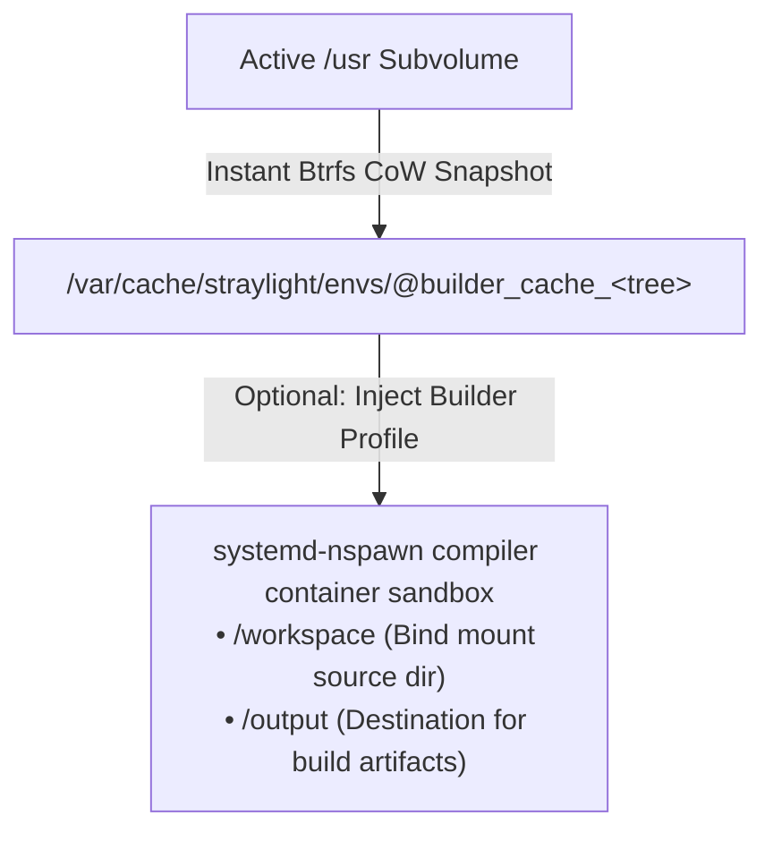
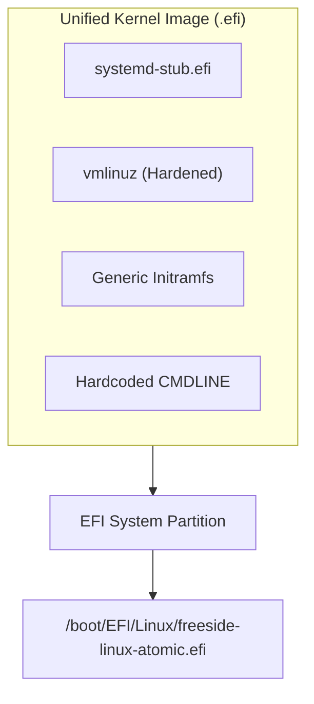
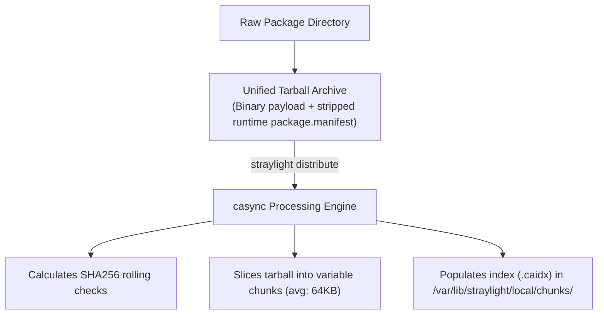
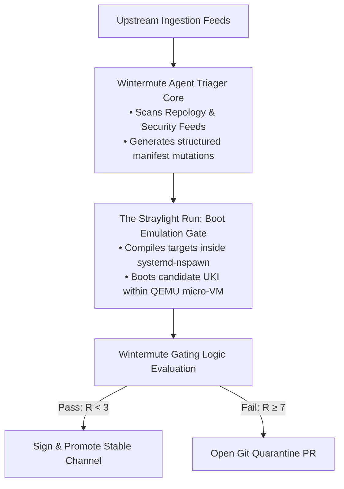
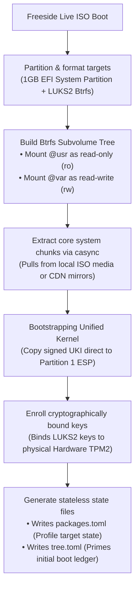
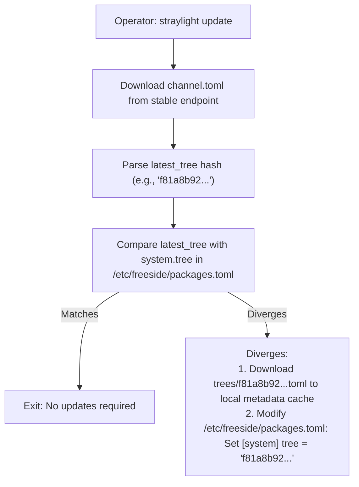
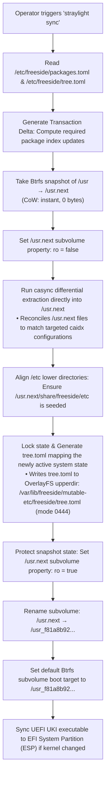

# Freeside OS: Technical Specification

**Version:** 1.2.0-Draft  
**Author:** Freeside Architecture Group  
**Classification:** Technical Blueprint

## 1. Executive Summary & Philosophy

**Freeside** is a next-generation, independent Linux distribution engineered for resilience, absolute predictability, and zero-maintenance overhead. Named after the high-orbit luxury habitat in *Neuromancer*, Freeside operates on a strict ideological separation between global system states and local workspace customizations.

### Core Tenets

- **Declarative & Stateless Core:** The base operating system operates as an immutable, read-only system image. Any machine state is fully reconstructed from a single declarative target configuration.
- **Modern Systemd Stack:** We explicitly bypass legacy boot processes, custom service scripts, and dynamic init tools. Freeside treats systemd not just as an init system, but as a complete OS management framework.
- **Content-Addressable Deployment:** Filesystem payloads are transported and indexed via byte-level, content-addressable chunking rather than traditional file-by-file archives.
- **Zero Compilation Leakage:** System binaries are never built on the active production system. Compilation is strictly handled within isolated, transient sandbox containers that match the host's runtime library definitions precisely.

## 2. Core Technology Stack

Freeside is built from scratch utilizing modern, memory-safe, and highly optimized components.

| Component | Technology | Rationale |
| :--- | :--- | :--- |
| **C Standard Library** | `musl-libc` | Clean, lightweight, strict compliance, avoids bloat |
| **System Utilities** | `uutils` | Modern, Rust-based, memory-safe replacements |
| **Service & Init** | `systemd` | Unified network, time, login, and process execution |
| **Bootloader** | `systemd-boot` + UKI | Pre-built, signed images loaded by UEFI |
| **Filesystem** | Btrfs | Subvolumes, CoW snapshots, integrity checks |
| **Synchronization** | `casync` | Chunk-based transport minimizing overhead |
| **Package CLI** | `straylight` | Privileged/unprivileged hybrid engine in Rust |

## 3. Filesystem & Disk Layout

Freeside enforces a strict **UsrMerge** directory layout. The dynamic linker, system libraries, configuration templates, and basic system utilities are located exclusively under the `/usr` prefix.

### Core Directory Hierarchy

```text
/
├── bin -> usr/bin
├── sbin -> usr/bin
├── lib -> usr/lib
├── lib64 -> usr/lib
├── boot/
│   └── EFI/
│       ├── BOOT/
│       └── Linux/                 <-- Location of active UKIs
├── etc/                           <-- OverlayFS mutable layer
├── var/                           <-- Mutable persistent storage
└── usr/                           <-- Mounted read-only (Btrfs Subvol)
    ├── bin/
    ├── lib/
    ├── share/
    └── lib/freeside/              <-- System profiles
```

### Storage Layer Architecture

To maintain absolute resilience and simple system recovery, the disk layer separates mutable and immutable data using a combination of **Btrfs Subvolumes** and **OverlayFS**:

```text
                  ┌───────────────────────────────┐
                  │          / (Root)             │
                  └──────────────┬────────────────┘
                                 │
                 ┌───────────────┴───────────────┐
                 │                               │
  ┌──────────────▼──────────────┐ ┌──────────────▼──────────────┐
  │         /etc (Overlay)      │ │     /usr (Btrfs Subvol)     │
  ├─────────────────────────────┤ ├─────────────────────────────┤
  │ Upper (Mutable): /var/etc   │ │ Read-Only File Store        │
  │ Lower (Immutable): usr/etc  │ │ Managed by casync           │
  └─────────────────────────────┘ └─────────────────────────────┘
```

- **The /usr Subvolume:** This volume is mounted as completely read-only (`ro`) during normal operations. It contains the entire immutable operating system core.
- **The /etc Overlay:** To allow runtime modifications while preserving the ability to reset to defaults, `/etc` is mounted via OverlayFS:
  - **Lower Layer (lowerdir):** `/usr/share/freeside/etc/` (stock defaults).
  - **Upper Layer (upperdir):** `/var/lib/freeside/mutable-etc/` (user-modified files).
  - **Work Directory (workdir):** `/var/lib/freeside/etc-work/` (required for atomic transactions).
  - **Mount Options:** `redirect_dir=on,index=on,xino=on`
  - **Result:** Deleting the upper layer instantly restores the system to factory defaults.

## 4. Monorepo Architecture

All of Freeside's code lives in a single unified upstream monorepo to ensure atomic commits and centralized versioning.

```text
freeside/ (Monorepo)
├── bootstrap/                   # Stage0 bootstrapping
├── straylight/                  # Core Rust utility suite
├── installer/                   # TUI installer
├── wintermute/                  # AI-driven maintainer daemon
├── system/                      # Base settings
└── packages/                    # Package manifests
```

## 5. The Configuration Model & Package States

A Freeside node is configured through files located within `/etc/freeside/`. To guarantee absolute alignment and prevent configuration out-of-sync issues, Freeside strictly decouples its system target definitions from its active runtime states.

```text
/etc/freeside/
├── straylight.toml   # Global settings
├── repos.toml        # Mirror list
├── packages.toml     # Desired target state (Writable)
└── tree.toml         # Active state manifest (Read-Only)
```

### /etc/freeside/packages.toml (Writable Target)

This file defines the system's *desired target state*. Profiles implicitly supply their baseline packages; therefore, the lists under `[packages]` are strictly **additive**—defining only the extra components requested by the operator on top of the profile baseline.

```toml
[system]
profile = "desktop"
tree = "a4f10c3b889e212d5c4061a7bc21f8a70c367bb1e17da96dfbb0164c203b57e1"

[packages]
apps = [
    "kitty",
    "starship",
    "firefox"
]
```

### /etc/freeside/tree.toml (Read-Only Ledger)

This file represents the *actually synchronized and running state* of the current operating system boot layer. It is generated automatically by `straylightd` at the tail end of a successful straylight sync routine. It ensures that queries, audits, and sandboxed compilation targets resolve against actual binaries on disk, regardless of subsequent changes made to the mutable `packages.toml` target.

```toml
# Automatically generated by straylightd post-sync
tree = "a4f10c3b889e212d5c4061a7bc21f8a70c367bb1e17da96dfbb0164c203b57e1"
synced_at = 2026-06-13T15:47:00Z

[packages]
musl = "1.2.5-1"
uutils = "0.0.28-1"
systemd = "260.2"
```

### Profile Architecture & Composition

System profiles represent curated package collection baselines. Rather than maintaining static configuration templates in the monorepo, profiles are configured compositionally inside `system/profiles.toml` in the monorepo, and then compiled and flattened directly into each content-addressable upstream tree manifest (`trees/<tree_hash>.toml`). This ensures that the baseline dependencies for any profile remain strictly tied to, and validated against, a specific tree generation.

To resolve dynamic linking mismatches on runtime tools (such as Node, Python, or Go toolchains invoked via `mise`), our build and execution environments incorporate the `libc6-compat` (or `gcompat`) dynamic library shim layers natively.

### Monorepo Specification: system/profiles.toml

This file uses composition and inheritance to keep profile configurations modular and DRY:

```toml
[profiles.core]
description = "Minimal baseline tools"
packages = ["musl", "uutils-coreutils", "systemd", "straylight"]

[profiles.server]
inherits = "core"
packages = ["podman", "fish", "neovim", "tmux"]
```

#### Profile Ingestion Flow

During a system-wide release build, the compilation coordinator executes the following mapping step:

1. Parses `system/profiles.toml`.
2. Resolves inheritance nodes (e.g., recursive dependencies for `desktop` inherit everything in `server` and `core`).
3. Verifies every listed dependency is compiled successfully in the current release batch.
4. Generates a fully resolved flat array representing that profile, writing it directly to the target `trees/<tree_hash>.toml` manifest.

### Granular Package Overrides

Because of the OverlayFS layout over `/etc`, configuration changes made to an individual application (e.g., `/etc/kitty/kitty.conf`) are safely written to `/var/lib/freeside/mutable-etc/kitty/kitty.conf`.

The package manager leverages this clean segregation to implement atomic diffing and factory resets on a per-package basis without risking filesystem corruption or impacting neighboring packages.

## 6. Straylight CLI & Daemon Architecture

`straylight` splits execution across two distinct domains: a lightweight, unprivileged user-space CLI front-end and a privileged back-end system daemon activated on-demand via systemd socket operations.

### Socket-Activated Execution Model

To minimize active memory footprint, the privileged executor daemon `straylightd` is not persistent.

- Client opens connection to `/run/straylightd.sock`.
- `systemd` instantiates `straylightd.service` on-demand.
- Daemon gracefully terminates after completion.

### Peer Credential Authorization

To prevent unprivileged users from triggering system synchronization runs, the daemon validates client socket credentials using the kernel level peer socket option (`SO_PEERCRED`).

- The socket file at `/run/straylightd.sock` is locked to owner `root`, group `wheel`, with permissions set to `0660`.
- Upon receiving a connection, the daemon queries the kernel to verify the calling client's effective User ID (UID) is 0 (root) or their Group ID (GID) belongs to the administrative `wheel` group.

### Complete CLI Subcommand Matrix

The CLI provides a rich, unified user interface. Under the hood, these subcommands route commands either locally (for client-side/compilation chores) or over the IPC socket to the `straylightd` daemon (for privileged configuration or filesystem mutations).

| Subcommand | Domain | Functional Description |
| :--- | :--- | :--- |
| **sync** | System | Reconciles active layers with declarative config |
| **update** | Repository | Polls registry and updates `packages.toml` |
| **add** | Configuration | Appends package target to `packages.toml` |
| **build** | Compilation | Sandbox compilation of local source |
| **diff** | Diagnostics | Deep diff between stock defaults and user changes |
| **reset** | System | Deletes local overrides for a package |

## 7. The Compilation & Sandbox Pipeline

Freeside prohibits direct compilation of custom packages or third-party Git repositories inside the live system space. All compilation runs are redirected into an ephemeral `systemd-nspawn` container environment.



### Lazy Self-Healing Cache Generation

When building or deploying custom source configurations (e.g., items defined under `[packages.local]`), `straylight` manages its build environments automatically:

1. **Tree Matching Verification:** `straylight` looks for an existing Btrfs subvolume at `/var/cache/straylight/envs/@builder_cache_<tree_hash>`.
2. **Cache Initialization (On Miss):**
   - If not found, it takes an instantaneous Copy-on-Write (CoW) snapshot of the live `/usr` directory to use as a baseline (requiring **0 bytes** of extra disk space).
   - It temporarily updates the snapshot environment to use the builder profile and runs a local sync, pulling down standard development headers and compilation tools matching the current core system.
   - The subvolume is frozen as a persistent read-only snapshot: `@builder_cache_<tree_hash>`.
3. **Sandbox Execution:** `systemd-nspawn` mounts the matched cache with an ephemeral writable OverlayFS overlay, maps the package source folder to `/workspace`, and invokes the compilation commands.
4. **Housekeeping:** When the system updates to a new global tree version, outdated `@builder_cache` subvolumes are automatically identified and purged.

### Build Manifest Mechanics

Freeside separates the high-level build orchestration from the low-level package compilation. Internally, `straylight` maintains a standardized, global **master justfile** that acts as the primary orchestrator within the compiler sandbox.

#### The Two-Tiered Just Architecture

1. **The Global Master justfile:** Owned and maintained by the `straylight` system runtime. It automates common pre-build and post-build routines: downloading and verifying tarballs, cloning remote Git repositories, configuring environment variables (like `CC`, `CFLAGS`, `LDFLAGS`, and target architectures), creating standardized workspace environments, and dynamically importing the target package's build configurations.
2. **The Package-Specific package.justfile:** Provided by the package packager. It is kept as minimal and descriptive as possible, concentrating exclusively on the step-by-step directions required to build and temporarily stage the specific binaries.

### Conceptual Blueprint: Global Master justfile

```just
# Global Master justfile
export CC := "clang"
export CFLAGS := "-O2 -pipe -target x86_64-freeside-linux-musl"

import 'package.justfile'

_prepare src_url sha256_hash:
    #!/usr/bin/env bash
    curl -Ls "{{src_url}}" -o source.tar.xz
    echo "{{sha256_hash}}  source.tar.xz" | sha256sum -c
    tar -xf source.tar.xz
```

#### Package-Specific package.manifest

```toml
[package]
name = "zlib"
version = "1.3.1"
description = "System-level compilation and compression libraries"
dependencies = ["musl"]

[source]
url = "https://zlib.net/zlib-1.3.1.tar.xz"
sha256 = "9a93b2b7df7ab77cfca24bb1c34591e5a14db1b132f123014c95d66ca8d5e60d"
```

#### Package-Specific package.justfile

```just
# zlib package compilation instructions

build:
    cd zlib-* && ./configure --prefix=/usr --shared && make

package destdir:
    cd zlib-* && make DESTDIR="{{destdir}}" install
```

## 8. Unified Kernel Image (UKI) & UEFI Boot Protocol

Freeside has eliminated local initramfs generation, kernel hooks, and complex boot generation tools. The system utilizes a pre-compiled, cryptographically signed **Unified Kernel Image (UKI)** model loaded natively by the UEFI firmware.



### Anatomy of a Freeside UKI

The UKI is a single, self-contained UEFI PE executable containing the following sections stitched together using `ukify`:

- **.stub:** The `systemd-stub` UEFI bootloader helper.
- **.kernel:** Hardened Linux kernel image.
- **.initrd:** Generic initramfs with `systemd` and `udevd`.
- **.cmdline:** Hardcoded boot parameters.

### Security & Signing

For deployments utilizing UEFI Secure Boot:

1. The UKI is compiled on secure build infrastructures.
2. It is cryptographically signed using private distribution keys via `sbctl` or standard Hardware Security Modules (HSMs).
3. The matching public certificate is enrolled in the local machine's firmware database (`db`). Secure boot verifies the image integrity before executing the kernel.

### The ESP Deployment Vector

During a kernel-related system update, `straylight` bypasses all classic boot setup stages:

1. It downloads the pre-built `freeside-linux-vmlinuz.efi` via `casync`.
2. It writes the image directly into `/boot/EFI/Linux/freeside-linux-atomic.efi`.
3. On reboot, `systemd-boot` natively reads the folder, identifies the new OS release metadata inside the UKI binary, and presents it as the primary boot target.

## 9. Distribution Mechanics & casync

Synchronization in Freeside operates on a content-addressable model rather than file extraction. All binary outputs are processed through **casync** into chunked indexes.

To coordinate system-level rolling transactions, the upstream distribution repository (defined in `/etc/freeside/repos.toml`) maintains a structured matrix layout of index pools, channel heads, and metadata files.

### Upstream Directory Topology

```text
https://repos.freeside-os.org/channel-stable/
├── channel.toml                 # Pointer file tracking the channel's latest tree state
├── trees/
│   ├── a4f10c3b889e21...toml    # Complete system package manifest mapping for Tree A
│   └── f81a8b928172c9...toml    # Complete system package manifest mapping for Tree B
├── chunks/                      # The global casync content-addressable chunk pool (.cacnk)
│   ├── 0a2f7c...2b.cacnk
│   └── 9b4d1a...1c.cacnk
└── uki/
    ├── a4f10c3b889e21...efi     # Signed Unified Kernel Image matching Tree A
    └── f81a8b928172c9...efi     # Signed Unified Kernel Image matching Tree B
```

### Upstream Contract Schemas

#### 1. channel.toml

The distribution point registry indicating the current target release channel pointer.

```toml
channel = "stable"
updated_at = 2026-06-13T12:00:00Z
latest_tree = "f81a8b928172c95d5c4061a7bc21f8a70c367bb1e17da96dfbb0164c203b57e1"
latest_uki_sha256 = "6c5bc8d8a7fec06b12a8789bcde..."
```

#### 2. The Tree Manifest (trees/<tree_hash>.toml)

A strict registry tying every component in a release tree generation to its content-addressable index (`.caidx`) file.

```toml
tree = "f81a8b928172c95d5c4061a7bc21f8a70c367bb1e17da96dfbb0164c203b57e1"

[profiles.desktop]
packages = ["musl", "uutils-coreutils", "systemd", "straylight", "mesa", "cosmic-comp"]

[packages.musl]
version = "1.2.5-1"
caidx = "packages/musl-1.2.5-1.caidx"

[packages.straylight]
version = "0.1.0-1"
caidx = "packages/straylight-0.1.0-1.caidx"
```

### The Ingestion Pipeline

When a package is packaged, the resulting target file structure is ingested:



## 10. Wintermute Agent Architecture

Freeside treats package curation and testing as automated functions orchestrated by **Wintermute**. Written in Python and utilizing the **Google GenAI Python SDK**, Wintermute eliminates human manual work.



### Wintermute Operational Architecture

#### 1. Ingestion & Structured Triage

The Python agent tracks upstream targets and processes security reports. When an update arrives, Wintermute uses Gemini paired with specific Pydantic schemas (`response_schema`) to factually evaluate the change footprint and assign an operational update priority (LOW, MEDIUM, HIGH, CRITICAL) without regex parsing issues.

#### 2. Parallelized Sandbox Compilation

Approved triage definitions trigger local straylight build calls. Compile pipelines instantiate disposable `systemd-nspawn` environments, compile source binaries using the global master justfile, and package compressed artifacts to seed casync chunk generation blocks.

#### 3. The Straylight Run: Hardware-Mocked Boot Testing

Wintermute doesn't just test binaries; it verifies the **entire operating system state**. For every candidate release tree, it spawns an accelerated QEMU instance matching the architecture target, configures a software TPM2 daemon (`swtpm`), and streams the candidate UKI to verify:

- Successful systemd entrypoint execution within a 2-second timeout window.
- Proper read-only mounting of `/usr` and stateless composition of the OverlayFS `/etc` layer.
- Automatic cryptographic disk decryption via local virtualized TPM keys.
- Full service target reaching `multi-user.target` with 0 failed systemd units.

#### 4. Cognitive Release Gating

Following emulation logs parsing, Wintermute runs a final structured gating analysis, generating a **System Change Risk Index ($R$)** combining security severities, header symbol ABI changes, and code delta tracking sizes.

If risk boundaries are clear ($R < 2$), Wintermute invokes network HSM keys via PKCS#11 modules, cryptographically signs the new UEFI UKI image using `sbsign`, updates `trees/<tree_hash>.toml`, and shifts `channel.toml` pointers. If testing failures are encountered, Wintermute commits the delta to a `quarantine/` Git branch, isolates the build, and publishes an exhaustive Markdown diagnostic analysis report.

## 11. System Installation & Provisioning

The **freeside-installer** is a secure, interactive TUI written in Rust using the `ratatui` framework.



### Provisions and Security Configuration

1. **Target Disk Formatting:** Sets up a clean GPT partition layout:
   - **Partition 1:** FAT32 (1GB minimum), mounted to `/boot` (EFI System Partition, ESP).
   - **Partition 2:** LUKS2 encrypted Btrfs partition, containing the root pool.
2. **Subvolume Layout Creation:** Configures the Btrfs pool layout:
   - `@usr` (the immutable core system, mounted read-only)
   - `@var` (persistent local storage, mounted read-write)
3. **casync Extraction Phase:** Runs a local casync extract command directly into the target `@usr` subvolume from local USB media or remote mirrors, avoiding slow file-by-file copy loops.
4. **Bootstrapping the UKI:** Copies the signed pre-built Unified Kernel Image (`freeside-linux-atomic.efi`) directly to Partition 1 at `/boot/EFI/Linux/freeside-linux-atomic.efi`.
5. **TPM2 & Encryption Binding:** Binds the LUKS2 decryption key directly to the machine's Hardware TPM2 chip utilizing `systemd-cryptenroll --tpm2-device=auto --tpm2-pcrs=0+7`. This guarantees that the system will only auto-decrypt if firmware integrity checks pass and Secure Boot is strictly enforced.
6. **Writing Declarative Configuration State:** Generates `/etc/freeside/packages.toml` with the operator's chosen system profile and target tree pointer, and writes the matching read-only `/etc/freeside/tree.toml` file to record the successfully initialized base system state.

## 12. Operational Lifecycle Flows

### A. Operator Flow (End-User)

The system administrator interacts with the immutable environment via clean declarative states.

#### 1. System Update (straylight update)

The update routine is a metadata-only transaction. It polls upstream stable registry structures and mutates the desired local system profile configurations to point at the latest distribution tree.



*Note: After running update, the active operating environment is not modified. `/etc/freeside/tree.toml` remains set to the old active generation until a successful synchronization is executed.*

#### 2. System Synchronization (straylight sync)

This command reconciles the physical, running system with the desired target state specified in `/etc/freeside/packages.toml`. By referencing `/etc/freeside/tree.toml`, `straylight` calculates the explicit delta, downloads only the modified chunks, and implements a transactional Btrfs subvolume swap.



*If any failures occur during index replication or subvolume population, the transaction is canceled and the default subvolume boot target remains completely unmutated.*

#### 3. Diffing Package Configurations (straylight diff)

To see what configuration files have diverged from the pristine stock defaults shipped with the package profile:

```sh
straylight diff neovim
```

- **Behind the Scenes:** The engine fetches the immutable defaults path (`/usr/share/freeside/etc/neovim/`) and executes a standard GNU unified diff against the live overlay configurations (`/etc/neovim/` which includes user overrides from `/var/lib/freeside/mutable-etc/neovim/`).

#### 4. Resetting a Package to Defaults (straylight reset)

If an application's state becomes broken due to local configuration errors, the operator can reset the configuration state:

```sh
straylight reset neovim
```

- **Behind the Scenes:** `straylightd` accesses `/var/lib/freeside/mutable-etc/` and recursively removes the `neovim` subdirectory. Because the underlying `/usr/share/freeside/etc/neovim/` lower directory remains untouched, the overlay filesystem instantly presents the original default settings as the current configuration, restoring the factory defaults.

### B. Maintainer Flow (Distribution Developer)

Maintaining, testing, and distributing packages within the Freeside monorepo.

#### 1. Standard Modular Build Chain

To build, package, and distribute a package from source in the monorepo:

```sh
# Phase 1: Compile the package code inside the systemd-nspawn container
straylight build ./packages/zlib

# Phase 2: Extract clean production binaries and manifests into a tarball
straylight package ./packages/zlib --out ./artifacts/zlib.tar.gz

# Phase 3: Segment and distribute the tarball directly into the local repository chunks
straylight distribute ./artifacts/zlib.tar.gz
```

#### 2. Unified Release Build Action

To perform the entire pipeline sequentially and update the localized repository indices in a single command, use the release alias:

```sh
straylight release ./packages/zlib
```

This action builds the source, generates the clean package tarball, populates the chunk directory, updates the local repository indices, and prepares the system to pull the target during the next `straylight sync` operation.