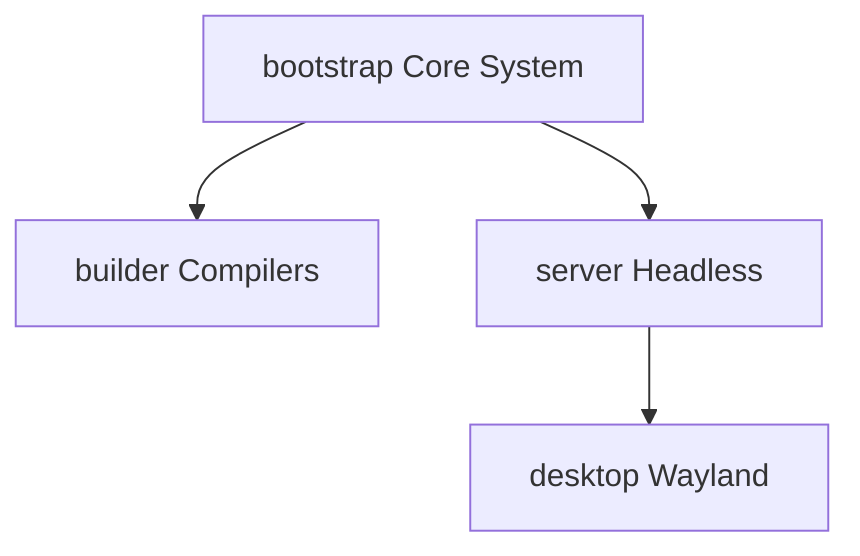

# Freeside OS: System Profiles & Package Registry

> [!NOTE]
> **Future State Specification**
> System profiles (and the inheritance configuration in `system/profiles.toml`) are part of the planned release orchestrator features and are **not yet implemented**. 
> 
> Currently, the system uses **Package Groups** (defined inside each package's `package.manifest`) as a mid-step to classify software. The compilation orchestrator (`straylight`) reads these groups (e.g., `base`, `builder`, `system`) to determine compile order. Once system profiles are implemented, they will define sets of groups mapping to target profiles (e.g. `Server` profile comprising `base` + `system` + `server` groups).

System profiles represent curated package collection baselines. Rather than maintaining static configuration templates in files, profiles are configured compositionally, and then compiled and flattened directly into each content-addressable upstream tree manifest (`trees/<tree_hash>.toml`). This ensures that the baseline dependencies for any profile remain strictly tied to, and validated against, a specific tree generation.

---

## 1. Profile Inheritance & Dependency Flow

Freeside minimizes composition bloat by strictly passing packages down an inheritance chain. When a node targets a specific profile, it implicitly acquires all packages from the parent layers:



---

## 2. Workspace Profile Ingestion Flow (Planned)

During a system-wide release build, the compilation coordinator will execute the following mapping step:
1.  Parses `system/profiles.toml`.
2.  Resolves inheritance nodes (e.g., recursive dependencies for `desktop` inherit everything in `server` and `core`).
3.  Verifies every listed dependency is compiled successfully in the current release batch.
4.  Generates a fully resolved flat array representing that profile, writing it directly to the target `trees/<tree_hash>.toml` manifest.

---

## 3. Profiles Configuration: `system/profiles.toml` (Planned)

This file uses composition and inheritance to keep profile configurations modular and DRY:

```toml
[profiles.core]
description = "Minimal baseline tools"
packages = ["musl", "uutils-coreutils", "systemd", "straylight"]

[profiles.server]
inherits = "core"
packages = ["podman", "fish", "neovim", "tmux"]
```

---

## 4. Package Groups Registry (Current State)

Rather than using profiles directly, the system currently classifies packages using **Package Groups** defined inside each package's `package.manifest`. The compilation orchestrator (`straylight`) uses these groups to organize dependencies and builds.

Below is the up-to-date registry of all packages sorted by their active package groups.

### A. The `base` Group

The foundational packages, containing the core C library (`musl`), shells, core utilities, and standard encryption/network layers.

| Package Name | Version | Description |
| :--- | :--- | :--- |
| [**`base-files`**](file:///home/dq/Code/freeside/packages/base-files/package.manifest) | `1.0.0` | Freeside OS base filesystem layout, directory topologies, and core OverlayFS templates |
| [**`bash`**](file:///home/dq/Code/freeside/packages/bash/package.manifest) | `5.2.21` | GNU Bourne Again Shell |
| [**`ca-certificates`**](file:///home/dq/Code/freeside/packages/ca-certificates/package.manifest) | `2024.07.02` | Mozilla CA certificate bundle for TLS verification |
| [**`curl`**](file:///home/dq/Code/freeside/packages/curl/package.manifest) | `8.8.0` | Command line tool and library for transferring data with URLs |
| [**`diffutils`**](file:///home/dq/Code/freeside/packages/diffutils/package.manifest) | `3.12` | GNU diffutils utilities |
| [**`findutils`**](file:///home/dq/Code/freeside/packages/findutils/package.manifest) | `4.10.0` | GNU utilities to locate files |
| [**`gawk`**](file:///home/dq/Code/freeside/packages/gawk/package.manifest) | `5.4.0` | GNU awk text processing utility |
| [**`git`**](file:///home/dq/Code/freeside/packages/git/package.manifest) | `2.45.1` | Fast, scalable, distributed revision control system |
| [**`grep`**](file:///home/dq/Code/freeside/packages/grep/package.manifest) | `3.12` | GNU grep utility |
| [**`gzip`**](file:///home/dq/Code/freeside/packages/gzip/package.manifest) | `1.13` | GNU compression utilities |
| [**`libffi`**](file:///home/dq/Code/freeside/packages/libffi/package.manifest) | `3.4.6` | Portable foreign function interface library |
| [**`musl`**](file:///home/dq/Code/freeside/packages/musl/package.manifest) | `1.2.5` | musl C library (libc) implementation for Freeside |
| [**`ncurses`**](file:///home/dq/Code/freeside/packages/ncurses/package.manifest) | `6.4` | System V-compatible terminal screen handling library |
| [**`openssl`**](file:///home/dq/Code/freeside/packages/openssl/package.manifest) | `3.3.0` | Secure Sockets Layer toolkit |
| [**`python3`**](file:///home/dq/Code/freeside/packages/python3/package.manifest) | `3.12.3` | Python Programming Language |
| [**`readline`**](file:///home/dq/Code/freeside/packages/readline/package.manifest) | `8.2` | GNU readline library for interactive line editing |
| [**`sed`**](file:///home/dq/Code/freeside/packages/sed/package.manifest) | `4.10` | GNU stream editor |
| [**`sqlite`**](file:///home/dq/Code/freeside/packages/sqlite/package.manifest) | `3.45.3` | Self-contained, serverless, zero-configuration SQL database engine |
| [**`tar`**](file:///home/dq/Code/freeside/packages/tar/package.manifest) | `1.35` | GNU tape archiver |
| [**`uutils-coreutils`**](file:///home/dq/Code/freeside/packages/uutils-coreutils/package.manifest) | `0.0.28` | Rust implementation of GNU coreutils |
| [**`zlib`**](file:///home/dq/Code/freeside/packages/zlib/package.manifest) | `1.3.1` | A free, general-purpose, lossless data-compression library |

### B. The `builder` Group

The compilation toolchain, compiler infrastructure, and auxiliary build helpers.

| Package Name | Version | Description |
| :--- | :--- | :--- |
| [**`bison`**](file:///home/dq/Code/freeside/packages/bison/package.manifest) | `3.8.2` | GNU general-purpose parser generator |
| [**`bzip2`**](file:///home/dq/Code/freeside/packages/bzip2/package.manifest) | `1.0.8` | High-quality data compressor |
| [**`ccache`**](file:///home/dq/Code/freeside/packages/ccache/package.manifest) | `4.10.2` | A fast compiler cache |
| [**`cmake`**](file:///home/dq/Code/freeside/packages/cmake/package.manifest) | `3.29.3` | Cross-platform, open-source build system |
| [**`file`**](file:///home/dq/Code/freeside/packages/file/package.manifest) | `5.45` | Fine Free File Command |
| [**`flex`**](file:///home/dq/Code/freeside/packages/flex/package.manifest) | `2.6.4` | Fast lexical analyzer generator |
| [**`gcompat`**](file:///home/dq/Code/freeside/packages/gcompat/package.manifest) | `1.1.0` | The GNU C Library compatibility layer for musl |
| [**`gettext`**](file:///home/dq/Code/freeside/packages/gettext/package.manifest) | `0.22.5` | GNU internationalization utilities |
| [**`gperf`**](file:///home/dq/Code/freeside/packages/gperf/package.manifest) | `3.1` | Perfect hash function generator |
| [**`just`**](file:///home/dq/Code/freeside/packages/just/package.manifest) | `1.36.0` | Just a handy command runner |
| [**`linux-headers`**](file:///home/dq/Code/freeside/packages/linux-headers/package.manifest) | `7.1` | Linux kernel headers for userspace development |
| [**`llvm`**](file:///home/dq/Code/freeside/packages/llvm/package.manifest) | `18.1.6` | The LLVM Compiler Infrastructure (including Clang, LLD, Compiler-RT) |
| [**`m4`**](file:///home/dq/Code/freeside/packages/m4/package.manifest) | `1.4.19` | GNU macro processor |
| [**`make`**](file:///home/dq/Code/freeside/packages/make/package.manifest) | `4.4.1` | GNU Make utility to maintain groups of programs |
| [**`meson`**](file:///home/dq/Code/freeside/packages/meson/package.manifest) | `1.4.0` | High-productivity build system |
| [**`ninja`**](file:///home/dq/Code/freeside/packages/ninja/package.manifest) | `1.12.1` | Small build system with a focus on speed |
| [**`patch`**](file:///home/dq/Code/freeside/packages/patch/package.manifest) | `2.7.6` | Apply a diff file to an original |
| [**`patchelf`**](file:///home/dq/Code/freeside/packages/patchelf/package.manifest) | `0.18.0` | A utility for modifying ELF binaries' dynamic linker and rpath |
| [**`perl`**](file:///home/dq/Code/freeside/packages/perl/package.manifest) | `5.38.2` | Practical Extraction and Report Language |
| [**`pkgconf`**](file:///home/dq/Code/freeside/packages/pkgconf/package.manifest) | `2.2.0` | Package compiler and linker configuration tool |
| [**`rsync`**](file:///home/dq/Code/freeside/packages/rsync/package.manifest) | `3.3.0` | A fast, versatile, remote (and local) file-copying tool |
| [**`rust`**](file:///home/dq/Code/freeside/packages/rust/package.manifest) | `1.96.0` | The Rust Programming Language Compiler and Cargo |
| [**`setuptools`**](file:///home/dq/Code/freeside/packages/setuptools/package.manifest) | `69.5.1` | Easily download, build, install, upgrade, and uninstall Python packages |
| [**`unzip`**](file:///home/dq/Code/freeside/packages/unzip/package.manifest) | `6.0` | ZIP extraction utility |
| [**`xz`**](file:///home/dq/Code/freeside/packages/xz/package.manifest) | `5.6.2` | LZMA compression utilities |
| [**`zstd`**](file:///home/dq/Code/freeside/packages/zstd/package.manifest) | `1.5.6` | Fast real-time compression algorithm |

### C. The `system` Group

System management utilities, core system daemons, service orchestration, and main system libraries.

| Package Name | Version | Description |
| :--- | :--- | :--- |
| [**`dbus-broker`**](file:///home/dq/Code/freeside/packages/dbus-broker/package.manifest) | `37` | Linux D-Bus Message Broker - high-performance drop-in replacement |
| [**`libarchive`**](file:///home/dq/Code/freeside/packages/libarchive/package.manifest) | `3.7.4` | Multi-format archive and compression library |
| [**`libcap`**](file:///home/dq/Code/freeside/packages/libcap/package.manifest) | `2.70` | POSIX 1003.1e capabilities library |
| [**`libexpat`**](file:///home/dq/Code/freeside/packages/libexpat/package.manifest) | `2.6.2` | Stream-oriented XML parser library |
| [**`straylight`**](file:///home/dq/Code/freeside/packages/straylight/package.manifest) | `1.0.0` | Straylight Package Manager CLI |
| [**`systemd`**](file:///home/dq/Code/freeside/packages/systemd/package.manifest) | `255` | System and Service Manager |
| [**`util-linux`**](file:///home/dq/Code/freeside/packages/util-linux/package.manifest) | `2.40.1` | Miscellaneous system utilities for Linux |
| [**`vim`**](file:///home/dq/Code/freeside/packages/vim/package.manifest) | `9.1.1000` | Improved vi-style text editor |
