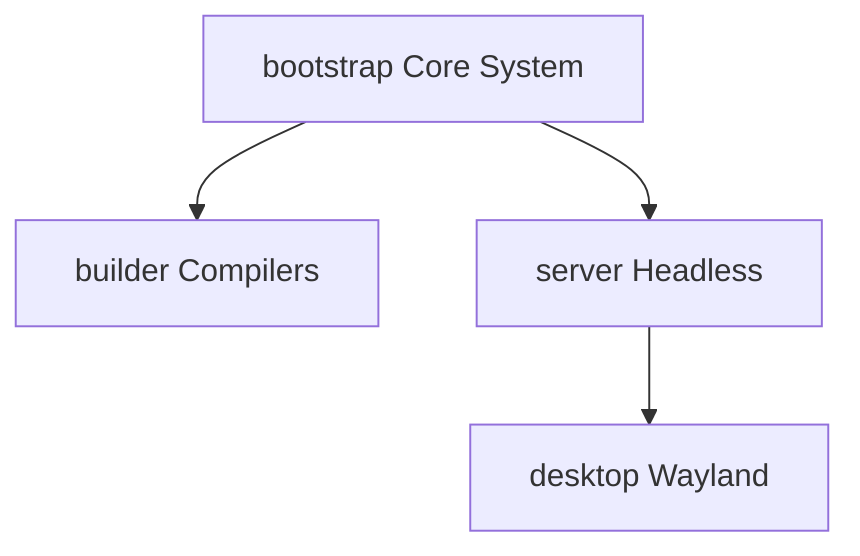

# Freeside OS: System Profiles & Package Registry

> [!NOTE]
> **Future State Specification**
> System profiles (and the inheritance configuration in `system/profiles.toml`) are part of the planned release orchestrator features and are **not yet implemented**. 
> 
> Currently, the system uses **Package Groups** (defined inside each package's `package.manifest`) as a mid-step to classify software. The compilation orchestrator (`straylight`) reads these groups (e.g., `base`, `builder`, `system`) to determine compile order. Once system profiles are implemented, they will define sets of groups mapping to target profiles (e.g. `Server` profile comprising `base` + `system` + `server` groups).

System profiles represent curated package collection baselines. Rather than maintaining static configuration templates in files, profiles are configured compositionally, and then compiled and flattened directly into each content-addressable upstream tree manifest (`trees/<tree_hash>.toml`). This ensures that the baseline dependencies for any profile remain strictly tied to, and validated against, a specific tree generation.

---

## 1. Profile Inheritance & Dependency Flow

Freeside minimizes composition bloat by strictly passing packages down an inheritance chain. When a node targets a specific profile, it implicitly acquires all packages from the parent layers:



---

## 2. Workspace Profile Ingestion Flow (Planned)

During a system-wide release build, the compilation coordinator will execute the following mapping step:
1.  Parses `system/profiles.toml`.
2.  Resolves inheritance nodes (e.g., recursive dependencies for `desktop` inherit everything in `server` and `core`).
3.  Verifies every listed dependency is compiled successfully in the current release batch.
4.  Generates a fully resolved flat array representing that profile, writing it directly to the target `trees/<tree_hash>.toml` manifest.

---

## 3. Profiles Configuration: `system/profiles.toml` (Planned)

This file uses composition and inheritance to keep profile configurations modular and DRY:

```toml
[profiles.core]
description = "Minimal baseline tools"
packages = ["musl", "uutils-coreutils", "systemd", "straylight"]

[profiles.server]
inherits = "core"
packages = ["podman", "fish", "neovim", "tmux"]
```

---

## 4. Curated Profile Registries

### A. The `bootstrap` Profile

The minimal, zero-dependency baseline required to mount filesystems, bring up local network slices, execute the early init phase, and invoke straylight:

| Package Name | Link Target / Format | Operational Role |
| :--- | :--- | :--- |
| **`musl`** | `/lib/ld-musl-x86_64.so.1` | Standard C library and dynamic linker |
| **`uutils-coreutils`**| Dynamic (musl) | Rust-native system utilities (`ls`, `cp`, `mkdir`, etc.) |
| **`systemd`** | Dynamic (musl) | Init system, `udev`, `logind`, `networkd`, `resolved` |
| **`straylight`** | Dynamic (musl) | Custom package manager and state orchestrator |
| **`linux-hardened`** | Native Kernel EFI | Hardened, long-term support kernel |
| **`btrfs-progs`** | Dynamic (musl) | Filesystem maintenance, snapshot, and volume scaling |
| **`cryptsetup`** | Dynamic (musl) | LUKS2 volume encryption and disk-unlocking layers |
| **`libarchive`** | Dynamic (musl) | Multi-format archive/streaming engine for container extractions |
| **`sbctl`** | Dynamic (musl) | Secure Boot key manager used to cryptographically enroll UKI targets |
| **`dbus-broker`** | Dynamic (musl) | High-performance D-Bus message bus broker |
| **`kbd`** | Dynamic (musl) | Early console keymaps, layouts, and system fonts |
| **`gnupg`** | Dynamic (musl) | GnuPG cryptographic keys and file signature validation engine |
| **`tpm2-tools`** | Dynamic (musl) | Low-level command-line tools to interact with physical TPM2 chips |

### B. The `builder` Profile
*Inherits: bootstrap*  
The foundational toolchain layer. Contains the LLVM/Clang compiler block, Cargo toolsets, automation runtimes, and the glibc compat layer to ensure that build scripts invoking dynamic helper tools run correctly:

```toml
[profile.builder]
inherits = "bootstrap"
packages = [
    # Compiler Toolchain Core
    "llvm",
    "clang",
    "lld",
    "compiler-rt",
    
    # Rust & Python Development Cores
    "rust",
    "cargo",
    "python3",
    "python-pip",
    
    # Automation & Optimization Tooling
    "just",
    "make",
    "pkgconf",
    "patchelf",
    "ccache",
    
    # Networking, Version Control & File Tracing
    "git",
    "curl",
    "openssl",
    "file",
    
    # Compression Suite
    "zstd",
    "xz",
    "gzip",
    "bzip2",

    # Compatibility Layers
    "libc6-compat" # Resolves glibc linker calls inside build containers
]
```

### C. The `server` Profile
*Inherits: bootstrap*  
A lightweight, headless environment customized for remote access, secure network meshes, and terminal container operations:

*   **`dropbear`:** Ultra-minimalist SSH server replacement bound to a systemd socket (`dropbear.socket`).
*   **`wireguard-tools`:** Fast, modern VPN configuration managed directly by `systemd-networkd`.
*   **`nftables`:** Lightweight, unified packet filtering engine replacing legacy `iptables`.
*   **`tailscale`:** Statically compiled Go network mesh daemon bypassing host libc configurations.
*   **`podman`:** Daemonless, rootless container engine integrating natively with systemd user slices.
*   **`podman-docker`:** Transparent `/usr/bin/docker` symlink wrapper for immediate script compatibility.

### D. The `desktop` Profile
*Inherits: server*  
A modern Wayland workstation layout targeting desktop hardware. Includes graphic drivers and the Cosmic DE suite:

*   **`mesa`:** OpenGL, Vulkan, and GLES drivers.
*   **`wayland` / `wayland-protocols`:** Core communication protocol definitions for graphics composers.
*   **`cosmic-comp` / `cosmic-de`:** Memory-safe Rust Wayland compositor and desktop environment stack.
*   **`seatd`:** Minimal seat management daemon for graphics hardware multiplexing.
*   **`pipewire` / `wireplumber`:** Audio/video streams and policy managers.
