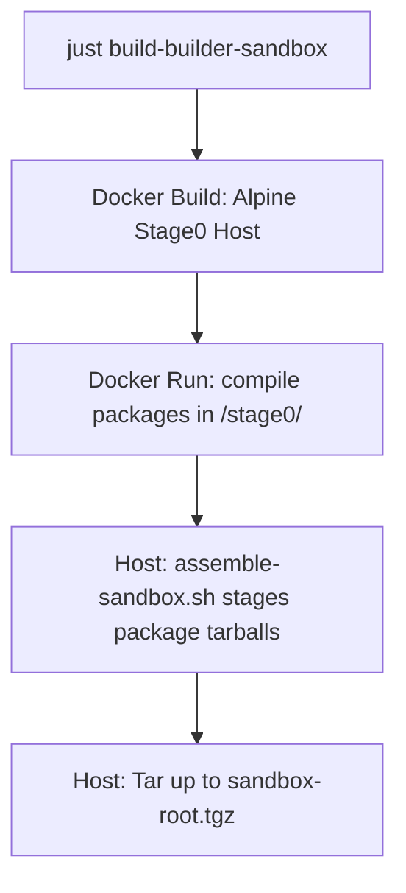

# Freeside OS: Bootstrapping & Compiler Sandbox Specification

## 1. Overview & Objective

The objective of the bootstrapping system is to generate the **Builder Sandbox** (`build/sandbox-root.tgz`). 

This sandbox is a minimal, self-contained root filesystem that contains all the packages from the `base` and `builder` groups. The Straylight package manager uses this sandbox to run clean, isolated, and reproducible builds of Freeside packages inside ephemeral `systemd-nspawn` containers.

---

## 2. Bootstrapping Architecture

Bootstrapping is divided into three distinct phases to ensure isolation and reproducibility:



### Phase A: Stage0 Host Build Environment (Docker)
We use Alpine Linux 3.20 as our Stage0 build host environment because it is musl-based, matching Freeside's target triple (`x86_64-freeside-linux-musl`).
*   **Definition**: `bootstrap/Dockerfile`
*   **Role**: Installs all native toolchains (Clang, LLVM, LLD, Rust, Cargo, CMake, Make, Ninja, Meson), build scripts, shell utilities, and target development headers (musl-dev, zlib-dev, openssl-dev, readline-dev, etc.) required to build Freeside packages from source.
*   **Mounts**: The workspace's `packages/` directory is mounted read-only at `/freeside/packages` and the `build/` directory is mounted at `/freeside/build`.

### Phase B: Inside the Container Package Compilation
The compilation script compiles all base and builder packages inside the Stage0 Docker host.
*   **Definition**: `bootstrap/build-packages.sh`
*   **Process**:
    1.  Parses TOML manifests from `/freeside/packages/*/package.manifest` using Python's `tomllib`.
    2.  Filters packages to only those belonging to the `base` and `builder` groups.
    3.  Performs a topological sort on dependencies to establish the correct build order.
    4.  Extracts and compiles each package in `/tmp/build/` using `just build` followed by `just package`.
    5.  Bundles the staging directories to `.tar.gz` packages saved to `/freeside/build/bootstrap/packages/`.
    6.  Installs the newly compiled package into the container's host prefix `/usr` so later packages in the topological order can build against them.

### Phase C: Host Rootfs Assembly
The assembly script runs on the development machine (outside of Docker) to create the actual sandbox filesystem.
*   **Definition**: `bootstrap/assemble-sandbox.sh`
*   **Process**:
    1.  Inspects the built tarballs under `build/packages/` and extracts those belonging to the `base` and `builder` groups into a staging directory.
    2.  Sets up the **UsrMerge** layout:
        *   `/bin` $\rightarrow$ `usr/bin`
        *   `/sbin` $\rightarrow$ `usr/bin`
        *   `/lib` $\rightarrow$ `usr/lib`
        *   `/lib64` $\rightarrow$ `usr/lib`
    3.  Creates system directories: `/tmp`, `/proc`, `/sys`, `/dev`, `/run`, `/var`, `/etc`, and `/root`.
    4.  Configures essential conveniences like `sh -> bash` and `python -> python3` symlinks.
    5.  Packs the rootfs into `build/sandbox-root.tgz` preserving file permissions and ownership (requires `sudo`).

---

## 3. Package Group Organization

To keep the builder sandbox lightweight and prevent init system or package manager pollution, package recipes organize metadata classifications into three groups inside their manifests:

*   **`base`**: The absolute minimum runtime environment required for system startup and command interpretation (e.g. `base-files`, `musl`, `bash`, `uutils-coreutils`, `ca-certificates`, `openssl`, `findutils`, `curl`, `git`, `gzip`, `zlib`, `ncurses`, `readline`, `python3`, `libffi`).
*   **`builder`**: Compilers, linkers, build automation, and compilation-time header environments (e.g. `llvm`, `rust`, `make`, `ninja`, `cmake`, `gettext`, `unzip`, `ccache`, `pkgconf`, `patchelf`).
*   **`system`**: User-space system management tools, service daemons, and components required for a running Freeside OS but **not** needed during compilation inside the sandbox (e.g. `systemd`, `straylight`, `libarchive`, `libcap`, `libexpat`, `util-linux`, `vim`).

---

## 4. Straylight Sandbox Integration

Straylight integrates with the sandbox using three strictly required environment variables (with no implicit defaults or fallbacks):

1.  **`STRAYLIGHT_PACKAGES_ROOT`**: Locates the packages source recipes and manifests (e.g. `/home/dq/Code/freeside/packages`).
2.  **`STRAYLIGHT_BUILDER_ROOT`**: Determines where the sandbox runtime files (`sandbox/`, `workspace/`, and `sandbox-root.tgz`) reside.
    *   Straylight checks for the sandbox directory under `$STRAYLIGHT_BUILDER_ROOT/sandbox`.
    *   If it does not exist, it locates `$STRAYLIGHT_BUILDER_ROOT/sandbox-root.tgz` and automatically extracts it to `$STRAYLIGHT_BUILDER_ROOT/sandbox` using host-side `tar`.
3.  **`STRAYLIGHT_BUILDER_OUTPUT_ROOT`**: Defines the destination folder where the compiled package binary tarballs (`.tar.gz`) are written.
4.  **Container Chroot execution**: Runs `systemd-nspawn -D $STRAYLIGHT_BUILDER_ROOT/sandbox` to execute compile recipes within the clean sandbox environment, bind-mounting the respective directories.

### Lazy Self-Healing Cache Generation

When building or deploying custom source configurations (e.g., items defined under `[packages.local]`), `straylight` manages its build environments automatically:

1.  **Tree Matching Verification:** `straylight` looks for an existing Btrfs subvolume at `/var/cache/straylight/envs/@builder_cache_<tree_hash>`.
2.  **Cache Initialization (On Miss):**
    *   If not found, it takes an instantaneous Copy-on-Write (CoW) snapshot of the live `/usr` directory to use as a baseline (requiring **0 bytes** of extra disk space).
    *   It temporarily updates the snapshot environment to use the builder profile and runs a local sync, pulling down standard development headers and compilation tools matching the current core system.
    *   The subvolume is frozen as a persistent read-only snapshot: `@builder_cache_<tree_hash>`.
3.  **Sandbox Execution:** `systemd-nspawn` mounts the matched cache with an ephemeral writable OverlayFS overlay, maps the package source folder to `/workspace`, and invokes the compilation commands.
4.  **Housekeeping:** When the system updates to a new global tree version, outdated `@builder_cache` subvolumes are automatically identified and purged.

---

## 5. Bootstrapping Purity & Self-Hosting Lifecycle

To eliminate Alpine Linux host library dependencies and achieve a 100% pure Freeside compilation environment, the system utilizes a multi-stage self-hosting cycle:

### Stage 0: Alpine Bootstrap (Impure)
The bootstrap process (`just -f bootstrap/justfile build-builder-sandbox`) builds packages inside the Alpine container. Because Alpine's host compilers are used, some tools (like `clang`, `sed`, `grep`, `gawk`, and `diffutils`) link against Alpine system libraries (e.g., `libstdc++.so.6` or `libpcre2-8.so.0`). To ensure these tools can run inside the initial sandbox, these helper libraries are exported to the initial `sandbox-root-bootstrap.tgz`.

### Stage 1: Sandbox Recompilation (99% Pure)
When the root coordinator runs `just build-builder-sandbox`, the build directory is cleared, the bootstrap sandbox is extracted, and `straylight` rebuilds all `base` and `builder` packages from source *inside* the isolated sandbox. 
Since the build runs inside the Freeside sandbox:
1. Custom packages like `sed`, `grep`, `diffutils`, and `gawk` are compiled using Freeside’s own toolchain with NLS disabled.
2. The newly compiled packages link only against Freeside's native libraries (such as LLVM's C++ library `libc++.so` instead of GNU's `libstdc++.so.6`).
3. The resulting packages are packaged into `build/sandbox-root.tgz`.

### Stage 2: Self-Hosting Purity (100% Pure)
To complete the cycle, the recompiled, pure sandbox is promoted to the bootstrap image:
```bash
cp build/sandbox-root.tgz build/sandbox-root-bootstrap.tgz
```
Running the root coordinator `just build-builder-sandbox` a second time extracts the sandbox from this pure image. The compilation now executes entirely using Freeside-built binaries and compilers, discarding any remaining Alpine bootstrap binaries and ensuring a fully self-hosting, 100% pure distribution.

