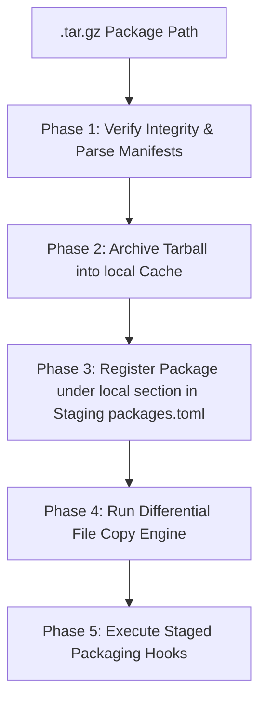
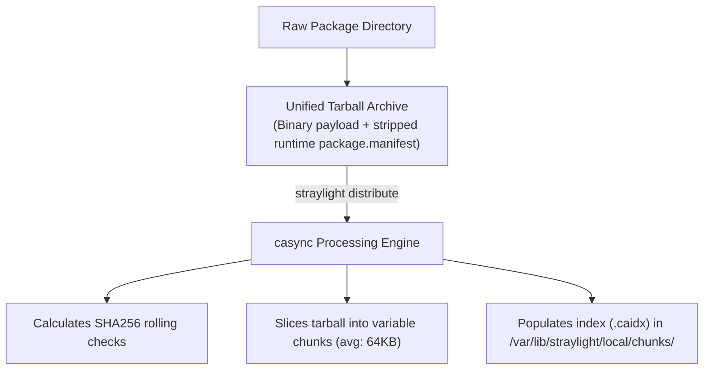
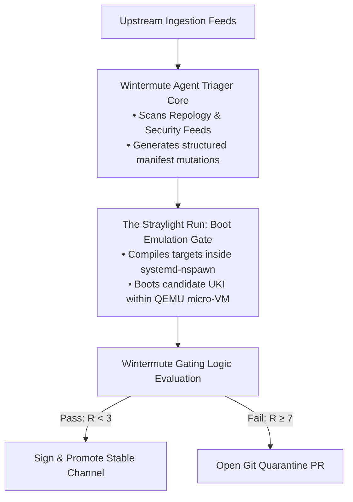

# Freeside OS: Package Management & Deployment Specification

## 1. Straylight CLI & Daemon Architecture

Freeside splits package management and state mutations across two distinct domains: a lightweight, unprivileged user-space CLI front-end (`straylight`) and a privileged back-end system daemon (`straylightd`) activated on-demand via systemd socket operations.

### Socket-Activated Execution Model

To minimize active memory footprint, the privileged executor daemon `straylightd` is not persistent:

1.  **Connection Request:** The client CLI opens a connection to Unix socket `/run/straylightd.sock`.
2.  **Activation:** `systemd` intercepts the call and instantiates `straylightd.service` on-demand.
3.  **Command Execution:** The CLI hands off command contexts and receives streamed log outputs over the socket.
4.  **Graceful Termination:** The daemon terminates itself after a configurable idle timeout period.

### Peer Credential Authorization

To prevent unprivileged users from mutating the system state, the daemon validates client socket credentials using the kernel-level peer socket option (`SO_PEERCRED`):

*   The socket file at `/run/straylightd.sock` is locked to owner `root`, group `wheel`, with permissions set to `0660`.
*   Upon connection, the daemon queries the socket peer information to verify the calling client's effective User ID (UID) is 0 (root) or their Group ID (GID) belongs to the administrative `wheel` group. If not, the socket connection is aborted immediately.

### Complete CLI Command Mapping

Under the hood, subcommands are processed either locally (for client-side packaging or compilation chores) or routed over the IPC socket to `straylightd` (for system synchronization or filesystem mutations):

| Subcommand | Execution Domain | Description |
| :--- | :--- | :--- |
| **`sync`** | Privileged Daemon | Reconciles active system layers with declarative `packages.toml` target |
| **`update`** | Local / User Space | Polls upstream distribution registry and bumps tree reference in `packages.toml` |
| **`add <pkg>`** | Local / User Space | Appends a package target definition to `packages.toml` |
| **`build <path>`** | Local / User Space | Performs sandboxed compilation of local source directory |
| **`install-pkg <file>`**| Local Staging Stride | Differential installation of a local `.tar.gz` package into a target staging root |
| **`diff <pkg>`** | Local / User Space | Computes a diff between pristine package stock settings and active overlay overrides |
| **`reset <pkg>`** | Privileged Daemon | Deletes OverlayFS upper overrides for a package, restoring stock factory defaults |

---

## 2. Straylight Local Package Installation Engine

The `straylight install-pkg` command provides a direct local package installation pipeline that bypasses the remote `casync` chunking system. It is designed for fast developer feedback loops where packages built via `straylight build` need to be installed directly into a staging environment.

```sh
straylight install-pkg <path_to_pkg.tar.gz>
```

### Staging Isolation Model

To support stateless transitions, `install-pkg` **never writes directly to the active system root**. Instead, it targets configurable paths:

| Environment Variable | Purpose | Default Fallback |
| :--- | :--- | :--- |
| `STRAYLIGHT_RW_SYSTEM_ROOT` | Target staging root directory (e.g. `/usr.next`) | `/tmp/straylight_staging_root` |
| `STRAYLIGHT_PKG_CACHE_ROOT` | Offline local package cache storage directory | `/var/cache/straylight/packages/` |

### Package Registration Isolation

Package registration updates `packages.toml` under the **staging root's** `/etc` directory, preventing mutations from leaking onto the running host:

```text
Staging Config Path: <STRAYLIGHT_RW_SYSTEM_ROOT>/etc/freeside/packages.toml
```

### Execution Phases



#### Phase 1: Package Integrity Verification
1.  Opens the `.tar.gz` package payload.
2.  Extracts `meta/files.toml` and `meta/package.manifest` directly into memory.
3.  Parses both files, validating schema compatibility. If invalid, the transaction aborts.

#### Phase 2: Package Caching
1.  Reads target `STRAYLIGHT_PKG_CACHE_ROOT`.
2.  Creates the directory structure if missing.
3.  Copies the `.tar.gz` package to the cache directory, renaming it to `<name>-<version>-<build_id>.tar.gz` for version preservation.

#### Phase 3: Registration in Staging Ledger
Adds or updates the package entry under `[packages.local]` in the staging root's `/etc/freeside/packages.toml`:

```toml
[packages.local.kitty]
path = "/var/cache/straylight/packages/kitty-0.35.0-1.tar.gz"
version = "0.35.0"
```

#### Phase 4: Differential File Copy Engine
For each file declared in the package's `meta/files.toml`:
1.  **Map Destination:** Resolves the final path as `<STRAYLIGHT_RW_SYSTEM_ROOT>/<relative_path>` (strips `./` prefix).
2.  **Difference Check:** Compares the existing file against the declared state (checking size, SHA256 checksum, UNIX permissions/mode, owner UID, and group GID).
3.  **Conditional Extraction:**
    *   **Identical:** Skips writing entirely (minimizing drive write wear).
    *   **Divergent/Missing:** Extracts the file from the tarball, writes it atomically to a temporary file next to the destination, renames it over the target, and applies the declared permissions and ownership metadata.

#### Phase 5: Hook Execution
If the package includes lifecycle scripts in `meta/hooks/`:
1.  Extracts each hook to a temporary directory.
2.  Executes hooks in alphabetical order, exporting `STRAYLIGHT_RW_SYSTEM_ROOT` and package metadata to the script execution environment.
3.  Purges temporary hook scripts upon completion.

---

## 3. Package Ingestion & Distribution

Synchronization in Freeside operates on a content-addressable model rather than raw file extractions. All binary outputs are processed through **casync** into chunked indexes.

### The Ingestion Pipeline

When a package is finalized, it is ingested using the following pipeline:



1.  **Archive Packaging:** The raw build files are tarred into a unified archive.
2.  **Slicing and Chunking:** `straylight distribute` invokes `casync` to slice the archive into variable-sized chunks using a rolling hash algorithm.
3.  **Metadata Registration:** Chunks are saved into the global chunk repository (`/var/lib/straylight/local/chunks/`), and a `.caidx` index map is generated to register the file structure.

---

## 4. Overlay Configuration Resets & Diffing

Because of the OverlayFS layout over `/etc`, configuration changes made to an individual application (e.g., `/etc/kitty/kitty.conf`) are safely written to the mutable `/var/lib/freeside/mutable-etc/kitty/kitty.conf` directory.

### Diff Engine (`straylight diff <package>`)
*   The engine locates the stock configuration path stored in the read-only layer: `/usr/share/freeside/etc/<package>/`.
*   It performs a GNU unified diff comparison against the active overlay configurations under `/etc/<package>/` (which includes the user modifications located in the upper layer `/var/lib/freeside/mutable-etc/`).

### Factory Reset Engine (`straylight reset <package>`)
*   To restore factory defaults, the daemon accesses `/var/lib/freeside/mutable-etc/` and recursively removes the directory matching `<package>`.
*   Because the underlying `/usr/share/freeside/etc/<package>/` lower directory remains untouched, the OverlayFS mount instantly presents the pristine stock defaults to the user-space applications.

---

## 5. Wintermute Curator & Gating Agent

Freeside treats package curation and system testing as automated, AI-augmented loops managed by the **Wintermute** curator agent.



### Operational Steps

1.  **Ingestion & Triage:** The Python-based agent tracks security databases and Repology feeds. When updates are found, it uses Gemini with strict Pydantic schemas to output structured manifest updates and assign update priorities.
2.  **Compilation Pipeline:** The triaged changes trigger a local `straylight build` call, compiling packages topologically inside an ephemeral container.
3.  **Mocked Emulation Testing ("The Straylight Run"):** For every release tree, Wintermute spawns an accelerated QEMU instance, initializes a software TPM (`swtpm`), and boot-tests the candidate UKI to verify:
    *   System boot finishes within a 2-second timeout window.
    *   Stateless OverlayFS mounts initialize correctly with `/usr` locked read-only.
    *   LUKS decryption succeeds automatically via virtualized TPM keys.
    *   No systemd units fail to reach `multi-user.target`.
4.  **Cognitive Gating:** Parses logs to compute a **System Change Risk Index ($R$)** combining security CVE severities, ABI changes, and code diff size.
    *   **$R < 2$:** Wintermute triggers private key signing via `sbctl`/HSM, signs the UEFI UKI executable, updates `trees/<tree_hash>.toml`, and pushes the release to the stable channel.
    *   **$R \ge 2$:** Isolates the candidate, opens a quarantine PR in the git repositories, and uploads a diagnostic report.
