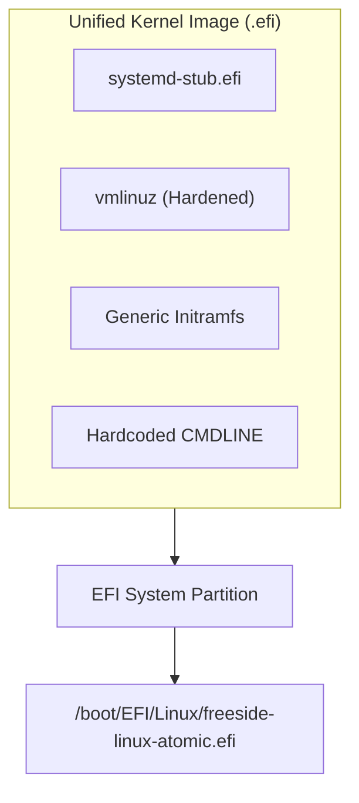
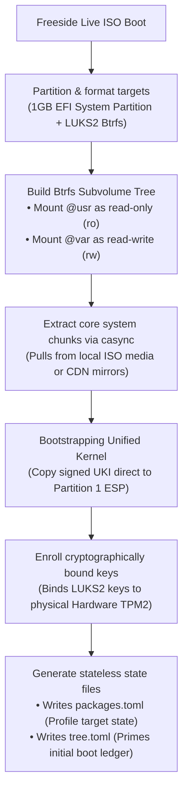
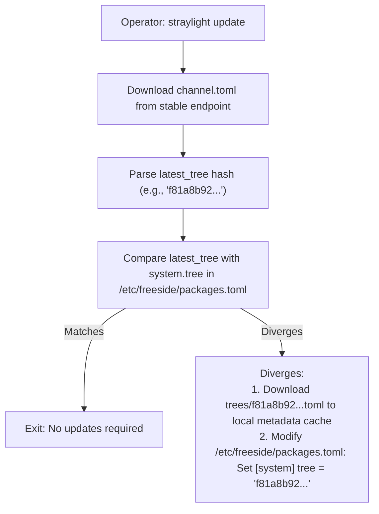
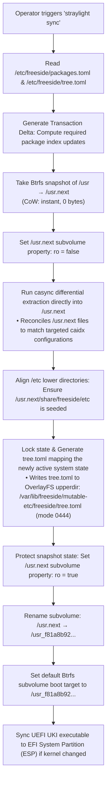

# Freeside OS: System Architecture Specification

## 1. Executive Summary & Philosophy

**Freeside** is a next-generation, independent Linux distribution engineered for resilience, absolute predictability, and zero-maintenance overhead. Named after the high-orbit luxury habitat in *Neuromancer*, Freeside operates on a strict ideological separation between global system states and local workspace customizations.

### Core Tenets

*   **Declarative & Stateless Core:** The base operating system operates as an immutable, read-only system image. Any machine state is fully reconstructed from a single declarative target configuration.
*   **Modern Systemd Stack:** We explicitly bypass legacy boot processes, custom service scripts, and dynamic init tools. Freeside treats systemd not just as an init system, but as a complete OS management framework.
*   **Content-Addressable Deployment:** Filesystem payloads are transported and indexed via byte-level, content-addressable chunking rather than traditional file-by-file archives.
*   **Zero Compilation Leakage:** System binaries are never built on the active production system. Compilation is strictly handled within isolated, transient sandbox containers that match the host's runtime library definitions precisely.

---

## 2. Core Technology Stack

Freeside is built from scratch utilizing modern, memory-safe, and highly optimized components:

| Component | Technology | Rationale |
| :--- | :--- | :--- |
| **C Standard Library** | `musl-libc` | Clean, lightweight, strict compliance, avoids bloat |
| **System Utilities** | `uutils` | Modern, Rust-based, memory-safe replacements |
| **Service & Init** | `systemd` | Unified network, time, login, and process execution |
| **Bootloader** | `systemd-boot` + UKI | Pre-compiled, signed images loaded by UEFI |
| **Filesystem** | Btrfs | Subvolumes, CoW snapshots, integrity checks |
| **Synchronization** | `casync` | Chunk-based transport minimizing overhead |
| **Package CLI** | `straylight` | Privileged/unprivileged hybrid engine in Rust |

---

## 3. Filesystem & Disk Layout

Freeside enforces a strict **UsrMerge** directory layout. The dynamic linker, system libraries, configuration templates, and basic system utilities are located exclusively under the `/usr` prefix.

### Core Directory Hierarchy

```text
/
├── bin -> usr/bin
├── sbin -> usr/bin
├── lib -> usr/lib
├── lib64 -> usr/lib
├── boot/
│   └── EFI/
│       ├── BOOT/
│       └── Linux/                 <-- Location of active UKIs
├── etc/                           <-- OverlayFS mutable layer
├── var/                           <-- Mutable persistent storage
└── usr/                           <-- Mounted read-only (Btrfs Subvol)
    ├── bin/
    ├── lib/
    ├── share/
    └── lib/freeside/              <-- System profiles
```

### Storage Layer Architecture

To maintain absolute resilience and simple system recovery, the disk layer separates mutable and immutable data using a combination of **Btrfs Subvolumes** and **OverlayFS**:

```text
                  ┌───────────────────────────────┐
                  │          / (Root)             │
                  └──────────────┬────────────────┘
                                 │
                 ┌───────────────┴───────────────┐
                 │                               │
  ┌──────────────▼──────────────┐ ┌──────────────▼──────────────┐
  │         /etc (Overlay)      │ │     /usr (Btrfs Subvol)     │
  ├─────────────────────────────┤ ├─────────────────────────────┤
  │ Upper (Mutable): /var/etc   │ │ Read-Only File Store        │
  │ Lower (Immutable): usr/etc  │ │ Managed by casync           │
  └─────────────────────────────┘ └─────────────────────────────┘
```

*   **The /usr Subvolume:** This volume is mounted as completely read-only (`ro`) during normal operations. It contains the entire immutable operating system core.
*   **The /etc Overlay:** To allow runtime modifications while preserving the ability to reset to defaults, `/etc` is mounted via OverlayFS:
    *   **Lower Layer (lowerdir):** `/usr/share/freeside/etc/` (stock defaults).
    *   **Upper Layer (upperdir):** `/var/lib/freeside/mutable-etc/` (user-modified files).
    *   **Work Directory (workdir):** `/var/lib/freeside/etc-work/` (required for atomic transactions).
    *   **Mount Options:** `redirect_dir=on,index=on,xino=on`
    *   **Result:** Deleting the upper layer instantly restores the system to factory defaults.

---

## 4. Multi-Repository Workspace Architecture

To improve build modularity, decouple release cycles, and organize dependencies, Freeside's codebase is divided into separate sub-repositories under the `freeside-os` organization, with a local workspace coordinating development:

```text
freeside/ (Local Workspace)
├── bootstrap/                   # git@github.com:freeside-os/bootstrap.git
│                                # Stage 0/1 compilation engine, Docker build envs, sandbox packaging
├── packages/                    # git@github.com:freeside-os/packages.git
│                                # User-space and system declarative package manifests and recipes
├── straylight/                  # git@github.com:freeside-os/straylight.git
│                                # Rust CLI client, compilation daemon (straylightd), and state sync orchestrator
└── docs/                        # git@github.com:freeside-os/docs.git
                                 # System specifications, packaging guides, and diagrams
```

---

## 5. Unified Kernel Image (UKI) & UEFI Boot Protocol

Freeside has eliminated local initramfs generation, kernel hooks, and complex boot generation tools. The system utilizes a pre-compiled, cryptographically signed **Unified Kernel Image (UKI)** model loaded natively by the UEFI firmware.



### Anatomy of a Freeside UKI

The UKI is a single, self-contained UEFI PE executable containing the following sections stitched together using `ukify`:
*   **`.stub`:** The `systemd-stub` UEFI bootloader helper.
*   **`.kernel`:** Hardened Linux kernel image.
*   **`.initrd`:** Generic initramfs with `systemd` and `udevd`.
*   **`.cmdline`:** Hardcoded boot parameters.

### Security & Signing
For deployments utilizing UEFI Secure Boot:
1.  The UKI is compiled on secure build infrastructures.
2.  It is cryptographically signed using private distribution keys via `sbctl` or standard Hardware Security Modules (HSMs).
3.  The matching public certificate is enrolled in the local machine's firmware database (`db`). Secure boot verifies the image integrity before executing the kernel.

### The ESP Deployment Vector
During a kernel-related system update, `straylight` bypasses all classic boot setup stages:
1.  It downloads the pre-built `freeside-linux-vmlinuz.efi` via `casync`.
2.  It writes the image directly into `/boot/EFI/Linux/freeside-linux-atomic.efi`.
3.  On reboot, `systemd-boot` natively reads the folder, identifies the new OS release metadata inside the UKI binary, and presents it as the primary boot target.

---

## 6. System Installation & Provisioning

The **freeside-installer** is a secure, interactive TUI written in Rust using the `ratatui` framework.



### Provisions and Security Configuration

1.  **Target Disk Formatting:** Sets up a clean GPT partition layout:
    *   **Partition 1:** FAT32 (1GB minimum), mounted to `/boot` (EFI System Partition, ESP).
    *   **Partition 2:** LUKS2 encrypted Btrfs partition, containing the root pool.
2.  **Subvolume Layout Creation:** Configures the Btrfs pool layout:
    *   `@usr` (the immutable core system, mounted read-only)
    *   `@var` (persistent local storage, mounted read-write)
3.  **casync Extraction Phase:** Runs a local casync extract command directly into the target `@usr` subvolume from local USB media or remote mirrors, avoiding slow file-by-file copy loops.
4.  **Bootstrapping the UKI:** Copies the signed pre-built Unified Kernel Image (`freeside-linux-atomic.efi`) directly to Partition 1 at `/boot/EFI/Linux/freeside-linux-atomic.efi`.
5.  **TPM2 & Encryption Binding:** Binds the LUKS2 decryption key directly to the machine's Hardware TPM2 chip utilizing `systemd-cryptenroll --tpm2-device=auto --tpm2-pcrs=0+7`. This guarantees that the system will only auto-decrypt if firmware integrity checks pass and Secure Boot is strictly enforced.
6.  **Writing Declarative Configuration State:** Generates `/etc/freeside/packages.toml` with the operator's chosen system profile and target tree pointer, and writes the matching read-only `/etc/freeside/tree.toml` file to record the successfully initialized base system state.

---

## 7. Transactional Update & Rollback Flow

### Operator Flow: System Update (`straylight update`)

The update routine is a metadata-only transaction. It polls upstream stable registry structures and mutates the desired local system profile configurations to point at the latest distribution tree.



*Note: After running update, the active operating environment is not modified. `/etc/freeside/tree.toml` remains set to the old active generation until a successful synchronization is executed.*

### Operator Flow: System Synchronization (`straylight sync`)

This command reconciles the physical, running system with the desired target state specified in `/etc/freeside/packages.toml`. By referencing `/etc/freeside/tree.toml`, `straylight` calculates the explicit delta, downloads only the modified chunks, and implements a transactional Btrfs subvolume swap.



*If any failures occur during index replication or subvolume population, the transaction is canceled and the default subvolume boot target remains completely unmutated.*
