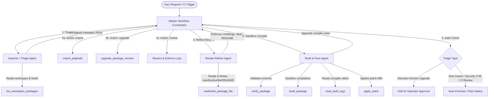

# Wintermute: System Architecture Specification

This document specifies the architecture, agents, tools, and workflows for **Wintermute**, the autonomous packaging agent for Freeside OS.

## 1. Architectural Blueprint & Connectivity

Wintermute utilizes a cooperative multi-agent design structured under a master Workflow Coordinator. Communication between agents and tools is achieved via shared state in the ADK `Session` context and standard filesystem operations.

## 2. Cooperative Sub-Agents

The agents are defined in the module [agent.py](file:///home/dq/Code/freeside/wintermute/app/agent.py):

*   **Master Workflow Coordinator (`root_agent = Workflow`)**: Operates as a graph-based coordinator (subclassing `BaseAgent`) that tracks overall session state, decides the step-by-step execution order, branches on user intent, and evaluates gating policies (rejection/approval).
*   **Importer / Triage Agent (`triage_agent`)**: Extracts the package name, determines the target group, classifies the action (`import`, `upgrade`, or `review`), and queries security feeds to check for high-severity CVEs (setting `is_security_update` dynamically).
*   **Recipe Refiner Agent (`refiner_agent`)**: Refines package specifications to match Freeside OS guidelines. It replaces hardcoded version strings with `$PKG_NAME` / `$PKG_VERSION`, adds `$DESTDIR` prefixes, appends directory permissions enforcement, maps Musl-libc dependencies, and validates `README.md` metadata tables.
*   **Build & Fixer Agent (`builder_agent`)**: Iteratively compiles package targets inside container sandboxes. On compiler error, it parses log files, designs and writes unified diff patches, and documents successful build tweaks under `## Upgrade Notes` in the package's `README.md`.

## 3. Core Packaging Tools

Packaging actions are executed via Python utilities defined in [tools.py](file:///home/dq/Code/freeside/wintermute/app/tools.py), wrapping Freeside’s `fspack.py` toolset and the host system’s sandboxing engine:

*   **`import_pkgbuild(pkg_name)`**: Fetches the raw PKGBUILD from Arch Linux and stubs `package.manifest`, `package.justfile`, and `README.md`.
*   **`upgrade_package_version(pkg_name, new_version)`**: Bumps version settings, updates source URLs, downloads the source archive to compute the updated SHA256 checksum, and updates `package.manifest` and `README.md`.
*   **`verify_package(pkg_name)`**: Audits manifest files for structural sanity, TOML schema correctness, topological circular dependencies, and correct `justfile` targets.
*   **`build_package(pkg_name)`**: Compiles packages inside isolated Musl-libc chroot container sandboxes (via `straylight build`).
*   **`read_build_logs(pkg_name)`**: Reads stdout/stderr from the sandbox log file on build failure.
*   **`apply_patch(pkg_name, target_file, patch_content)`**: Writes patch diffs under `packages/<pkg>/patches/` and registers them in the `justfile` extraction block.
*   **`read_package_file` / `write_package_file`**: File I/O interfaces for modifying package contents.

## 4. Packaging Workflows

Wintermute coordinates three major operational workflows:

### Workflow A: New Package Import
1.  **Triage**: Categorized as `"import"`.
2.  **Import**: Pulls PKGBUILD, stubs recipes, and creates a basic `README.md`.
3.  **Refine**: Enforces dynamic environment variables, UsrMerge prefix parameters, and permissions.
4.  **Build/Fix**: Iteratively compiles in the sandbox, auto-correcting any initial downloader or script issues.
5.  **Promote**: Autocomplete promotion.

### Workflow B: Package Upgrades
1.  **Triage**: Categorized as `"upgrade"`.
2.  **Upgrade**: Downloads new upstream source code to compute checksums and bumps manifest details.
3.  **Refine & Build**: Matches the recipe configuration and builds/verifies the package.
4.  **Cognitive Gating**:
    *   If it is a **Security Update** (high-severity CVE): Skip approval and promote immediately.
    *   If it is a **Standard Version Upgrade**: Pause workflow using Human-in-the-Loop (`RequestInput`) and await operator approval (`yes` / `no`) via chat before promoting.

### Workflow C: CI Review & Enforcement
1.  **Triage**: Categorized as `"review"` (runs on a single package or `"all"` packages).
2.  **Dependency Audit (Critical Check)**: Scans package manifests. If a package depends on library packages not found in the workspace, it immediately fails the CI check (`REJECT`) with a diagnostic warning.
3.  **Refine & Auto-fix (Minor Check)**: Checks for minor guidelines (e.g., missing README or hardcoded variables). If found, the `refiner_agent` auto-fixes them.
4.  **Build Audit**: Sandbox compiles the package. If compile fails, the `builder_agent` designs patches. If the build remains broken, it fails (`REJECT`); otherwise, it passes.
5.  **Output**: Emits a final CI report summarizing the PASS/REJECT status and list of applied fixes.
